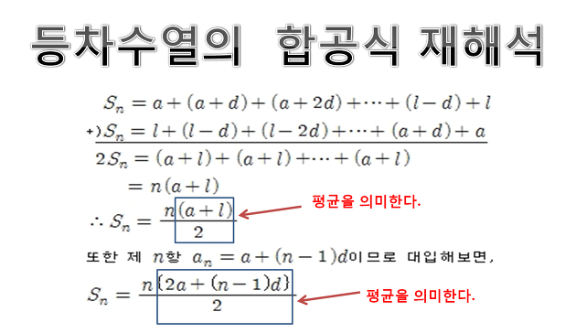

## 등차수열의 합 공식
http://www.ebsi.co.kr/ebs/lms/lmsx/retrieveSbjtDtl.ebs?sbjtId=S20180001037



## 항의 갯수
d: 공차
n: 항 번호
m: 첫번째 항이 되기위해 빼야 하는 숫자

dn - m = 항의 갯수

### 예제
등차수열의 합 1 + 3 + 5 + 7 + 9 + ... + 99의 값을 구하시오
첫번째 항이 1이 되기 위해서 공식을 대입하면 2n - 1 공식을 대입하면 첫번째 항이 1이 됨

99의 항을 알기 위해서는 2n - 1 = 99 가 되야 하므로 n은 50이므로 50번째 항이 됨

그럼 공식을 첫 항과 끝 항을 아니까 공식을 대입

(n * ( 1 + 50 )) / 2

### 반복문 없이 가우스 공식, 짝수 홀수의 합 구하는 공식을 활용하여 계산
```java
import java.util.Scanner;

/**
 * Created by KMS on 02/08/2020.
 */
public class SumGaussStudy {

    public static void main(String[] args) {

        Scanner stdIn = new Scanner(System.in);

        int start = 3;
        System.out.println(start+"부터 n까지의 합을 구합니다.");

        System.out.print("n의 값：");

        // 끝항의 값
        int l = stdIn.nextInt();

        // 공차 (증가 또는 감소 값)
        int d = 2;

        // 항의 갯수
        int n = 0;
        // 끝항과 같아질때까지 증가시켜 비교하는 값
        int m = 0;
        // m의 값이 끝항과 같아 질때까지 j값을 증가시켜 항의 갯수를 찾아냄
        while (l != m) {
            m = d * n +1;
            if(l != m) n+=1;
        }
        System.out.println("첫항 : "+start+", 끝항 : "+l+", 공차 : "+d+", 항의 갯수: "+n);

        // 1부터 순서대로 1씩 증가하는 항의 갯수를 구할때
        // 항의 갯수는 끝항인 n - start
        // int j = l - (start-1); // 첫항보다 1이 작아야 항의 갯수를 구할 수 있음

        // 등차수열의 합 공식 공차가 주어질 때 사용
        // 가장앞의 n 은 항의 갯수 현재는 끝항과 항의 갯수가 같으므로 아래와 같이 표현
        // n(항의 갯수) * ( (2 * a(첫항) + (n(항의 갯수) - 1) * d(공차) ) / 2
        int sum = (n * ((2 * start) + (n - 1) * d )) / 2;

        System.out.println(start+"부터 " + l + " 까지의 합은 " + sum + " 입니다.");
        // 첫항과 끝항을 알때의 공식
        // 가장 앞의 n(항의 갯수) * ( start(첫항) + l(끝항) ) 을 대입하면 등차수열의 합을 구하는 공식
        int sum2 = (n  * ( start + l )) / 2 ;

        System.out.println(start+"부터 " + l + " 까지의 합은 " + sum2 + " 입니다.");

        // https://m.cafe.daum.net/jaimiro/5OXt/1
        // 1 ~ start 까지의 짝수 홀수의 합
        // 5 ~ 20 까지라면 1 ~ 4 까지의 홀수의 합을 빼주어야 하므로 start 값인 5에서 -1을 뺀 4에서 나누기 2를 해서 2의 값을 빼주면 된다
        int startNum = (start - 1) / 2;
        System.out.println("startNum = "+startNum);

        // 홀수의 합 ( n 의 반은 홀수 n이 홀수이면 + 1을 더한다)
        int numOdd = l % 2 == 0 ? l / 2 : (l / 2) + 1;
        System.out.println("numOdd = "+numOdd);

        // n 제곱은 홀수의 합이다
        System.out.println("("+numOdd+" * "+numOdd+") - ("+startNum+" * "+startNum+")");
        int sumoOdd = (numOdd * numOdd) - (startNum * startNum);
        System.out.println(start+"부터 " + l + " 까지의 홀수의 합은 " + sumoOdd + " 입니다.");

        // 짝수의 합 ( n 의 반은 짝수)
        int numEven = l / 2;
        System.out.println("numEven = "+numEven);

        // n 제곱 + 짝수의 갯수를 더해주면 짝수의 합이다
        System.out.println("("+numEven+" * "+numEven+" + "+numEven+") - ("+startNum+" * "+startNum+" + "+startNum+")");
        int sumoEven = (numEven * numEven + numEven) - (startNum * startNum + startNum);
        System.out.println(start+"부터 " + l + " 까지의 짝수의 합은 " + sumoEven + " 입니다.");


        int sum3 = 0;
        int sum4 = 0;
        int i = start;
        while (i <= l) {
            if(i % 2 == 0) {
                sum4 += i;
            }
            if(i % 2 == 1) {
                sum3 += i;
            }
            i++;
        }
        System.out.println(start+"부터 " + l + " 까지의 홀수의 합은 " + sum3 + " 입니다.");
        System.out.println(start+"부터 " + l + " 까지의 짝수의 합은 " + sum4 + " 입니다.");
    }

}
```